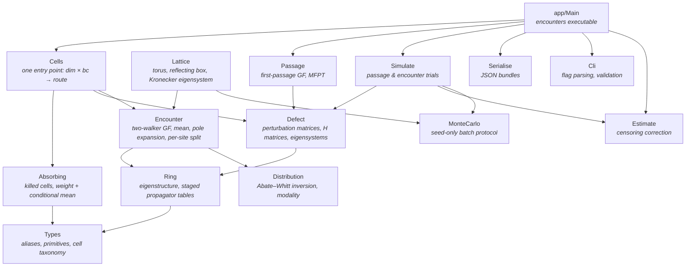

         

  

# mean-fet — Mean First-Encounter Time & PMF Solver

Exact first-encounter statistics for two lattice random walkers with independent mobilities `q₁`, `q₂` on six confined cells — the periodic ring, the reflecting interval and the absorbing interval in one dimension; the torus, the reflecting box and the absorbing box in two — optionally decorated with local defects (shortcuts, deleted bonds, permeable barriers, rewired bonds). Every mean is computed from the generating function, never sampled; Monte Carlo is a cross-check, not a source.

Companion code to *Dynamics of Encounters for Two Random Walkers* (MSc dissertation, School of Engineering Mathematics and Technology, University of Bristol, September 2026): the census of 9,186 mean curves and 192,906 cells in the dissertation was produced by this program, one invocation per grid point.

## What it computes

| Observable | How |
|---|---|
| **Mean first-encounter time** | Closed relative-walk form on the undecorated ring; contact-set renewal expanded about the pole at `z = 1` on the interval, torus and box; direct evaluation at `z = 1` on absorbing cells |
| **Splitting weight** | Probability the pair meets at all — unity on every measure-preserving cell, strictly inside `(0, 1)` on absorbing ones, always reported beside the mean it conditions |
| **Per-contact-site decomposition** | Splitting probabilities `Φⱼ` and site contributions `Φⱼ T̄ⱼ`, from a single pole expansion, mutually consistent to machine precision |
| **Encounter PMF** | Abate–Whitt inversion of the generating function on a damped contour, with a wired accuracy knob and radix-2 FFT; one distribution per contact site on request |
| **Censoring-corrected mean** | Recovers the unbiased mean from a distribution truncated at a finite horizon via the asymptotically geometric tail |
| **Monte Carlo cross-check** | Fixed batch protocol keyed on seed only — results identical at any core count, common random numbers across sweeps |
| **Single-walker first passage** | `--passage` mode: `F̃(z)` on the defected ring via the matrix determinant lemma, plus bimodality detection |

The cell taxonomy is dimension × boundary condition:

| Tag | Cell | Route |
|---|---|---|
| `1P` | periodic ring | closed form (two-mobility relative walk) |
| `1R` | reflecting interval | contact-set renewal, pole expansion |
| `1A` | absorbing interval | direct evaluation at the edge of the disc |
| `2P` | torus | contact-set renewal, pole expansion |
| `2R` | reflecting box | Kronecker-sum eigensystem + renewal |
| `2A` | absorbing box | direct evaluation at the edge of the disc |

## Requirements

Install [GHCup](https://www.haskell.org/ghcup/):

```bash
curl --proto '=https' --tlsv1.2 -sSf https://get-ghcup.haskell.org | sh
```

Then a GHC and Cabal:

```bash
ghcup install ghc recommended
ghcup install cabal recommended
ghcup set ghc recommended
ghcup set cabal recommended
```

The library builds against `base >= 4.14 && < 5`; the suite below was verified with GHC 9.4.7 and cabal 3.8.1.0.

`hmatrix` needs BLAS and LAPACK with headers:

- **Linux (Debian/Ubuntu)**: `apt install libblas-dev liblapack-dev`
- **macOS**: `brew install openblas lapack`
- **Windows**: install [OpenBLAS](https://github.com/OpenMathLib/OpenBLAS/releases) or use WSL

## Build

```bash
cabal build
```

## Test

```bash
cabal test
```

## Run

```bash
cabal run encounters -- [--passage | --encounter] [flags]
```

One invocation is one configuration; the result is one JSON document on stdout or in `--out FILE`. The mean and its per-site channels come from two evaluations of the generating function and take about a second on the reference cells; the distribution is a contour quadrature over thousands of nodes and is only formed when asked for.

The two reference configurations of the dissertation (sites are zero-based here, one-based in the text):

```bash
# 1R: interval of 96 sites, K = 8, q1 = 0.75, q2 = 0.09, walker A at 2, B at 48
cabal run encounters -- --encounter --dim 1 --bc reflecting \
    --n 96 --k 4 --q 0.75 --qB 0.09 --src 1 --srcB 47 \
    --want mean --out 1R/mean/cell_k8_q20p09.json
#   → Encounter MFPT (expanded): 515.6445331920643

# 2R14: 14 × 14 box, K = 4, walker A at (2,2), B at (5,5)
cabal run encounters -- --encounter --dim 2 --bc reflecting \
    --L 14 --k 1 --q 0.75 --qB 0.09 --src 1:1 --srcB 4:4 \
    --want mean --out 2R14/mean/cell_k4_q20p09.json
#   → Encounter MFPT (expanded): 457.8180143169382

# Ring with a shortcut, exact route cross-checked against 20,000 simulated pairs
cabal run encounters -- --encounter --dim 1 --bc periodic \
    --n 96 --k 2 --q 0.75 --qB 0.5 --src 0 --srcB 48 --sc 0:48 \
    --engine both --sim 20000 --seed 7 --want mean

# Single-walker first passage with the full distribution
cabal run encounters -- --passage --n 96 --k 4 --q 0.75 \
    --src 0 --tgt 48 --sc 0:47 --tmax 4000 --out passage.json
```

### Flags

| Flag | Meaning | Default |
|---|---|---|
| `--encounter`, `--passage` | two-walker first encounter, or single-walker first passage to `--tgt` | `--passage` |
| `--dim 1\|2` | dimension | `1` |
| `--bc periodic\|reflecting\|absorbing` | boundary condition | `periodic` |
| `--n N`, `--L L` | side, in one and in two dimensions | `96` |
| `--k k` | range `k`; connectivity is `2k` in 1D and `4k` in 2D | `4` |
| `--q`, `--qB` | mobilities `q₁` and `q₂`; `--qB` defaults to `--q` | `0.75` |
| `--rho R` | absorption probability on contact | `1.0` |
| `--src`, `--srcB`, `--tgt` | releases and target, zero-based, `X` in 1D and `X:Y` in 2D | `0`, `N/2`, `N/2` |
| `--want mean\|all\|sitepmf` | mean and channels only; with the distribution; with one distribution per contact site (`--no-pmf` ≡ `mean`) | `all` |
| `--tmax T`, `--acc A` | horizon and accuracy `A` of the inversion (`1 ≤ A ≤ 30`) | `2000`, `14` |
| `--sc U:V`, `--del U:V`, `--ws U:V`, `--barrier U:V:P` | two-way shortcut, deleted bond, rewired bond, permeable bond of permeability `P` — reversible, admitted on every engine | — |
| `--directed U:V`, `--asym U:V:D`, `--reset M:R` | one-way shortcut, biased bond, resetting to a site — irreversible, admitted only with `--engine sim` | — |
| `--engine exact\|sim\|both` | the exact route, a Monte Carlo cross-check, or both | `exact` |
| `--sim n`, `--seed S` | number of simulated pairs; generator seed | `0`, `42` |
| `--out FILE` | write the JSON document here instead of stdout | — |

### Output

| Field | Content |
|---|---|
| `config` | the configuration, with the connectivity written as a degree `K` |
| `encounter_mfpt`, `splitting_weight` | the mean, and the weight it is conditioned on |
| `splitting_probabilities`, `site_mean_contributions` | `Φⱼ` and `Φⱼ T̄ⱼ`, one entry per contact site |
| `diagnostics` | the route that produced the mean (`expanded`, `tail-corrected`, `sampled`), censored fraction, tail scale, self-consistency residual |
| `peaks`, `encounter_pmf`, `site_pmf` | extrema of the distribution; the distribution; one distribution per contact site (when asked for) |
| `simulation` | mean, conditional mean, censored fraction, tail scale, standard error and histogram of the Monte Carlo block (when run) |

In `--passage` mode the document carries `pmf`, `pure_ring_pmf` and `mfpt.{network, ring_exact, network_truncated_sum}` instead.

## Test suite

**387 tests · 16 spec modules · 361 HUnit cases + 26 QuickCheck properties · all passing (≈ 35 s, single core).**

```
All 387 tests passed (34.83s)
```

| Module | Tests | Strategy | What it establishes |
|---|:-:|---|---|
| `UnitSpec` | 33 | Unit | Spot checks: ring eigenstructure, transition matrices, matrix access, simulation |
| `PropertySpec` | 23 | Property | QuickCheck invariants: stochasticity, eigenvalue bounds, symmetry, PMF/CDF, walker accounting |
| `RegressionSpec` | 26 | Regression | Pinned values: Marris 2023, Marris 2025, bimodal and unimodal snapshots, determinism |
| `ConsistencySpec` | 7 | Consistency | Eigensystem vs defect GF, PMF vs simulation, FFT vs naive inversion |
| `BoundarySpec` | 16 | Boundary | Extremes of `N`, `K`, shortcut distance; simulation boundaries |
| `EncounterSpec` | 65 | Consistency | Every defect primitive, normalisation, agreement with simulation, splitting probabilities, modality, two-mobility path |
| `GridSpec` | 32 | Consistency | Torus symmetries, closed form vs inverted PMF, reflecting box, iterative pair-chain PMF, second-round anchors |
| `ReferenceSpec` | 19 | Reference | Targets derived outside the codebase: exact rationals, sixty-digit arithmetic, pair-chain solves, time iteration |
| `EstimateSpec` | 14 | Oracle | Censoring bias tracks the horizon; the correction recovers the exact mean; estimator ordering; provenance |
| `OracleSpec` | 17 | Oracle | Independent dense pair-chain linear solve — no GF, no spectrum — against the ring, torus and box engines |
| `DefectSpec` | 5 | Oracle | Finite-rank resolvent correction against outright inversion, one and two bonds, sign convention |
| `AbsorbingSpec` | 13 | Oracle | Killed spectrum, substochasticity, 1D and 2D against the pair chain, weight/conditional-mean convention |
| `CellsSpec` | 20 | Oracle | All six cells against the pair chain; closed-form availability; a defect in every cell |
| `PrimitiveSpec` | 40 | Property | Every primitive as a probability kernel at seven mobilities: row sums, positivity, detailed balance, continuity at `q → 1`, reversibility labels |
| `DecompositionSpec` | 24 | Consistency | Per-site weights and means sum to the mean; per-site PMFs sum to the total at every step; relabelling invariance; 2D |
| `SensitivitySpec` | 33 | Oracle | Mobility as a time change (one walker) and not (a pair); frozen partner; bare-ring minimum; exact midpoint decomposition |

```bash
cabal test

# By group
cabal test --test-option='-p "/Unit/"'
cabal test --test-option='-p "/Property/"'
cabal test --test-option='-p "/Regression/"'
cabal test --test-option='-p "/Lattice primitives/"'
cabal test --test-option='-p "/Per-site decomposition/"'
cabal test --test-option='-p "/Mobility sensitivity/"'

# Specific subgroup or test
cabal test --test-option='-p "/Torus exact symmetries/"'
cabal test --test-option='-p "/frozen partner/"'

# Verbose
cabal test --test-show-details=direct

# Opt-in: three slow L=16 reflecting-box reference cells (~30 s each)
ENCOUNTERS_SWEEP=1 cabal test
```

Unit: fast deterministic spot checks of individual function correctness
Property: QuickCheck universally quantified invariants (stochasticity, bounds, symmetry, PMF, CDF, kernels)
Regression: pinned known outputs to detect drift (Marris 2023, Marris 2025, snapshots)
Boundary: parameter space extremes and edge cases (large N, degenerate eigenvalues, simulation limits)
Consistency: agreement between independent computational routes (closed form vs renewal, exact vs simulation, GF inversion vs power iteration)
Reference: targets computed outside this codebase (exact rationals, sixty-digit arithmetic, pair-chain solves)
Oracle: an independent dense solve of the pair chain that shares no line with the machinery under test

### Validation claims

Every mean in the census is exact. Where the closed form of the ring and the contact renewal are run on the same configuration they agree to `5 × 10⁻¹⁴`; an independent linear solve on the full pair space, which forms no generating function and takes no spectrum, agrees with the renewal to `10⁻¹¹` across all four measure-preserving cells; and the per-site identity (weights sum to the splitting weight, site contributions sum to the mean) closes to five parts in `10¹⁴`.

---

## Architecture



Every module depends on `Types`; only the non-trivial edges are drawn. Data flows in five stages: **primitives → transition matrix** (`Defect`) → **eigensystem / propagator tables** (`Ring`, `Lattice`) → **generating function** (`Passage`, `Encounter`, `Absorbing`) → **mean by pole expansion, or PMF by contour inversion** (`Encounter`, `Distribution`, `Estimate`) → **JSON** (`Serialise`), with `Simulate` running the same configuration on the `MonteCarlo` protocol as an independent check.

---

## Project Structure

```
mean-fet/
├── encounters-ring.cabal               # Package: library + `encounters` exe + `spec` test suite
├── app/
│   └── Main.hs                         # CLI: --passage / --encounter, exact / sim / both
├── src/                                # Library (flat layout, ~3,850 lines)
│   ├── Types.hs                        # Aliases, defect primitives, reversibility, Domain taxonomy
│   ├── Ring.hs                         # Homogeneous ring eigenstructure, staged propagator tables
│   ├── Defect.hs                       # Primitives → perturbation matrices, defect-technique H, eigensystems
│   ├── Passage.hs                      # First passage / return GF on the defected ring, MFPT
│   ├── Distribution.hs                 # Abate–Whitt inversion, radix-2 FFT, modality
│   ├── Encounter.hs                    # Two-walker GF, mean, pole expansion, per-contact-site decomposition
│   ├── Absorbing.hs                    # Killed 1D/2D cells: splitting weight + conditional mean
│   ├── Lattice.hs                      # Torus and reflecting box, Kronecker eigensystem, iterative pair solver
│   ├── Cells.hs                        # encounterCell: dimension × boundary → engine, CellResult
│   ├── Estimate.hs                     # Censoring-corrected mean from a truncated distribution
│   ├── MonteCarlo.hs                   # Reproducibility protocol: batches keyed on seed only
│   ├── Simulate.hs                     # Monte Carlo passage / encounter trials, Welford merge
│   ├── Serialise.hs                    # JSON bundles via ByteString Builder
│   ├── Cli.hs                          # Flag parsing, range validation, output paths
│   └── Diagnostics.hs                  # GHCi diagnostics: mobility sweeps, site-resolved decomposition
└── test/                               # Test suite (16 spec modules, 387 tests, ~3,950 lines)
    ├── Spec.hs                         # Tasty runner
    ├── UnitSpec.hs                     # Deterministic spot checks
    ├── PropertySpec.hs                 # QuickCheck invariants
    ├── RegressionSpec.hs               # Pinned known outputs
    ├── ConsistencySpec.hs              # Cross-route agreement
    ├── BoundarySpec.hs                 # Parameter extremes
    ├── EncounterSpec.hs                # Primitives and encounter vs simulation
    ├── GridSpec.hs                     # Square-lattice solver
    ├── ReferenceSpec.hs                # Values derived outside the codebase
    ├── EstimateSpec.hs                 # Censoring correction
    ├── OracleSpec.hs                   # Independent pair-chain linear solve
    ├── DefectSpec.hs                   # Finite-rank resolvent correction
    ├── AbsorbingSpec.hs                # Absorbing cells vs pair chain
    ├── CellsSpec.hs                    # All six cells vs pair chain
    ├── PrimitiveSpec.hs                # Primitives as probability kernels
    ├── DecompositionSpec.hs            # Per-site decomposition identities
    └── SensitivitySpec.hs              # Mobility sensitivity of the mean
```

---

## Dissertation

*Dynamics of Encounters for Two Random Walkers — When a faster partner is met later: the mean encounter time on periodic and reflecting lattices, computed exactly.* Enzo Joly, MSc dissertation, School of Engineering Mathematics and Technology, University of Bristol, September 2026. Appendix B states the solver interface and the census this program enumerated; every number in the text traces to one invocation of `encounters`.

---

## License

[MIT](LICENSE) © 2026 Enzo Joly
